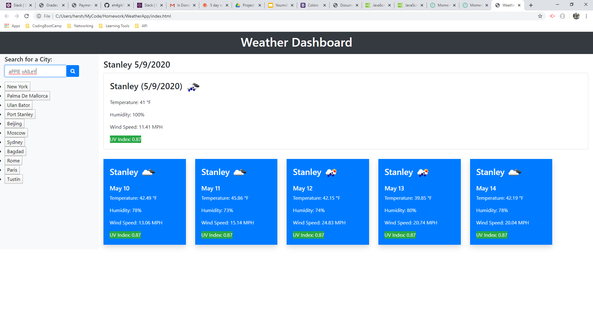
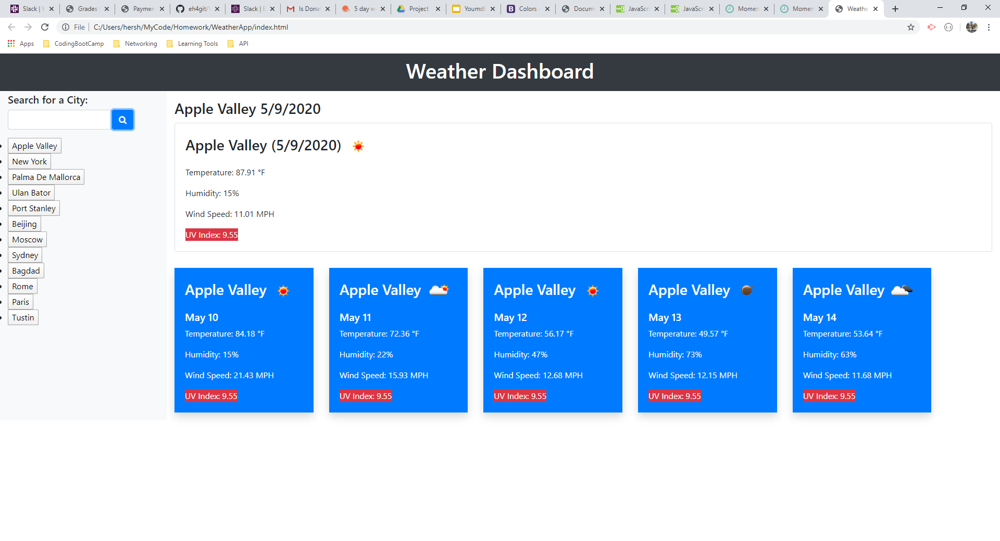

 # WeatherApp
  

### Table of Contents
* [Description](#Description)
* [Installation](#Installation)
* [Usage](#Usage)
* [Licence](#Licence)
* [Contributions](#Contributions)
* [Tests](#Tests)
* [Questions](#Questions)
  * [Profile Picture](#Profile_Picture)
  * [Github Email](#Github_Profile)
### Description
In this application I have created a weather dashboard. The dashboard contains a search box that the user will input their desired city name, when the search button is clicked the weather for the city will be displayed as well as a five day forecast below it. The city named will be saved as a button underneath the search input. If the button associated with the city is pressed the dashboard will display the weather for that city. The UV index has been color coded to easily alert the user. The user input is not case sensitive and will correct any case issues when searching the name and in the created button. The search field clears after each search and multiple buttons of the same city name will not be created. If the city is spelled incorrectly the search will produce no results and will not create a button. All buttons are saved to local history and rendered onto the page upon loading. 

### Installation
Follow the steps below to install the required node packages. 
All dependencies listed in package.json. In your terminal enter: npm i
### Usage
Deployed link: [WeaterApp](//eh4git.github.io/WeatherApp/) 
Run node index in the CLI and follow prompts. 
### Licence
This project uses the following licence(s): 
none
### Contributions
Please feel free to contribute in any way you wish. Please read the documentation and submit a pull request. Any contributions are greatly appreciated. Feedback is also welcomed.
### Tests
To test the application enter the following command into your terminal: 
In your terminal enter: npm run test
### Questions
Please direct any questions, comments, or concerns to my GitHub email provided below.
##### Profile_Picture
 
GitHub Profile: [eh4git](http://github.com/eh4git)
##### GitHub Email
ehirsch760@gmail.com
