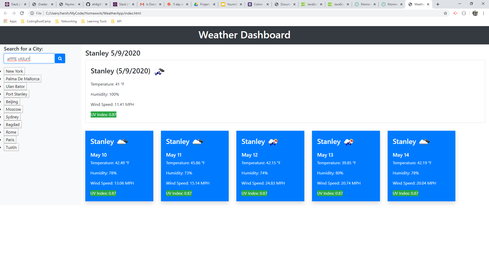

# WeatherApp
In this application I have created a weather dashboard. The dashboard contains a search box that the user will input their desired city name, when the search button is clicked the weather for the city will be dispalyed as well as a five day forecast below it. The city named will be saved as a button underneath the search input. If the button associated with the city is pressed the dashboard will display the weather for that city. The UV index has been color coded to easily alert the user. The user input is not case sensitive and will correct any case issues when searching the name and in the created button. The search field clears after each search and multiple buttons of the same city name will not be created. If the city is spelled incorrectly the search will produce no results and will not create a button. All buttons are saved to local history and rendered onto the page upon loading.

